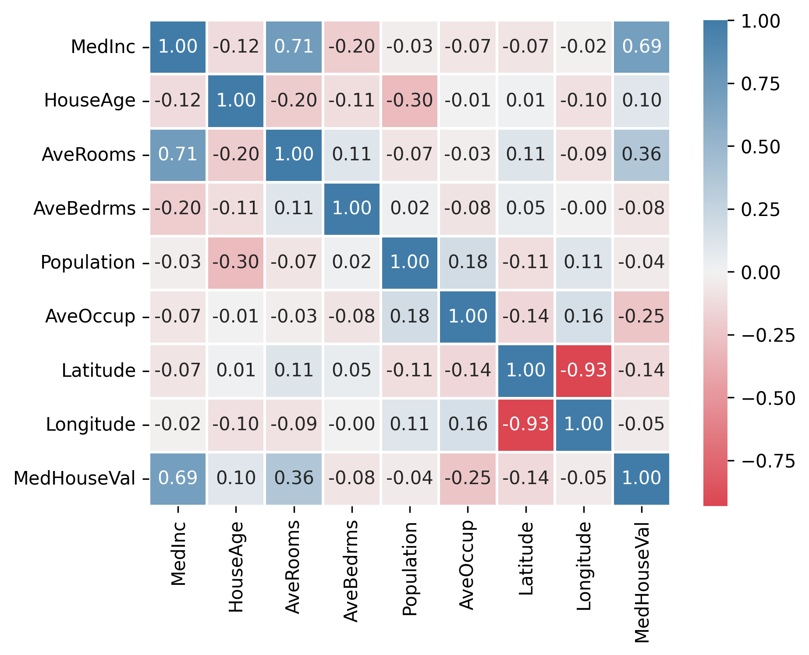

# California Housing Price Prediction

Este repositorio contiene un proyecto de predicción del valor de las casas en California utilizando varios algoritmos de Machine Learning. El objetivo es predecir la variable `MedHouseVal` (valor medio de las casas) a partir de un conjunto de características del mercado inmobiliario y demográficas en California.

## Descripción del Proyecto

El conjunto de datos utilizado proviene del conjunto de datos de `fetch_california_housing` de la biblioteca `scikit-learn`, y contiene las siguientes variables:

- **MedInc**: Ingreso medio por unidad de propiedad en el área.
- **HouseAge**: Edad media de las casas en el área.
- **AveRooms**: Promedio de habitaciones por vivienda.
- **AveBedrms**: Promedio de dormitorios por vivienda.
- **Population**: Población total en el área.
- **AveOccup**: Promedio de ocupación por vivienda.
- **Latitude**: Latitud de la ubicación.
- **Longitude**: Longitud de la ubicación.
- **MedHouseVal**: Valor medio de las casas (variable objetivo).

## Análisis Exploratorio de Datos (EDA)

Realicé un pequeño análisis exploratorio de datos (EDA) para comprender mejor las relaciones entre las variables. Durante este análisis, descubrí que:

- **MedInc** tiene una correlación de **0.71** con **AveRooms**, lo que sugiere una relación moderada entre estas dos variables.
- **Latitude** y **Longitude** tienen una **correlación negativa de 0.93**, lo que indica una fuerte relación inversa entre estas dos variables geográficas.

**Gráfico de Correlación**: Para visualizar estas relaciones y otras posibles correlaciones entre las variables, utilicé un **heatmap**. Aquí te muestro el gráfico de correlación obtenido:

Además, al analizar el resumen estadístico y realizar un **pairplot**, me percaté de que algunas características contenían **outliers**, lo que podría afectar las correlaciones y las predicciones. Para abordar este problema, decidí eliminar los outliers utilizando el método de **3 desviaciones estándar**, lo que ayudó a mejorar la calidad de los datos y evitar distorsiones en el modelo.

También noté que las características numéricas tenían diferentes escalas, por lo que utilicé **StandardScaler** para estandarizar los datos y mejorar el rendimiento de los modelos.

## Train-Test Split

Para evaluar los modelos, utilicé un **train-test split** con un tamaño de prueba (test size) del **20%** (0.2). Esto significa que el 80% de los datos se utilizaron para entrenar los modelos, y el 20% restante se utilizó para probar su desempeño en datos no vistos.

## Modelos Utilizados

A continuación, se describen los modelos utilizados para la predicción de los valores de `MedHouseVal`:

1. **Redes Neuronales (Keras)**: Utilicé cuatro modelos de redes neuronales. El primero usó el optimizador **Adam**, y los otros tres utilizaron el optimizador **SGD (Descenso de Gradiente Estocástico)** con tres diferentes tasas de aprendizaje (learning rates). Las redes neuronales fueron entrenadas con múltiples capas densas y funciones de activación ReLU.
2. **Regresión Lineal Múltiple**: Modelo de regresión simple para prever la relación lineal entre las variables predictoras y la variable objetivo.
3. **Árbol de Decisión**: Modelo basado en particiones recursivas de los datos, útil para capturar relaciones no lineales.
4. **Random Forest**: Un conjunto de árboles de decisión que ayuda a reducir la varianza y mejora la precisión del modelo.
5. **Gradient Boosting**: Un algoritmo de boosting que construye árboles de decisión de manera secuencial para corregir los errores de los modelos anteriores.
6. **XGBoost (Extreme Gradient Boosting)**: Una versión optimizada de Gradient Boosting que mejora la velocidad y la precisión de los modelos.

### Ajuste de Hiperparámetros

Para optimizar los hiperparámetros de los modelos, utilicé **RandomizedSearchCV**. Este método realiza una búsqueda aleatoria sobre un espacio de hiperparámetros definido para encontrar la mejor combinación posible de parámetros para cada modelo.

## Métrica de Evaluación

La métrica principal utilizada para evaluar los modelos fue el **RMSE** (Root Mean Squared Error o Raíz del Error Cuadrático Medio), que mide la diferencia promedio entre los valores predichos y los valores reales, penalizando más los errores grandes.

### Fórmula del RMSE:

La fórmula del RMSE es:

  

Un **RMSE** bajo indica que el modelo está realizando buenas predicciones, mientras que un valor alto indica que hay un error significativo en las predicciones.

## Resultados

A continuación, se presentan los valores de RMSE obtenidos para cada modelo entrenado:

| **Modelo**                  | **RMSE** |
|-----------------------------|----------|
| Regresión Lineal Múltiple    | 0.7632   |
| Árbol de Decisión           | 0.7615   |
| Random Forest               | 0.8594   |
| Gradient Boosting           | 0.4768   |
| XGBoost                     | 0.4552   |
| Redes Neuronales (Adam)     | 0.5565   |
| Redes Neuronales (SGD 0.001) | 0.7979   |
| Redes Neuronales (SGD 0.01)  | 0.6249   |
| Redes Neuronales (SGD 0.1)   | 0.5880   |

## Análisis de Resultados

Al observar los valores de RMSE, podemos ver que los mejores modelos para este conjunto de datos son **XGBoost** y **Gradient Boosting**, con RMSE de **0.4552** y **0.4768**, respectivamente. Estos dos modelos de boosting son los que mejor han generalizado, logrando los errores más bajos en las predicciones. **XGBoost** destacó no solo en términos de RMSE, sino también en velocidad de entrenamiento, siendo el modelo más eficiente en ese aspecto.

Por otro lado, los modelos de redes neuronales, a pesar de su complejidad, no lograron superar el rendimiento de **XGBoost** en cuanto a las métricas de error. El optimizador **Adam** en las redes neuronales obtuvo un RMSE de **0.5565**, mientras que el optimizador **SGD** con un learning rate de **0.001** alcanzó un RMSE de **0.7979**, lo que fue el peor desempeño entre las redes neuronales. Los otros modelos de SGD con diferentes tasas de aprendizaje (0.01 y 0.1) mostraron resultados de **0.6249** y **0.5880**, respectivamente.

Esto sugiere que los modelos basados en boosting (como **Gradient Boosting** y **XGBoost**) son los más adecuados para este tipo de predicción, debido a su capacidad para manejar relaciones no lineales en los datos y para mejorar la precisión mediante el enfoque iterativo.
